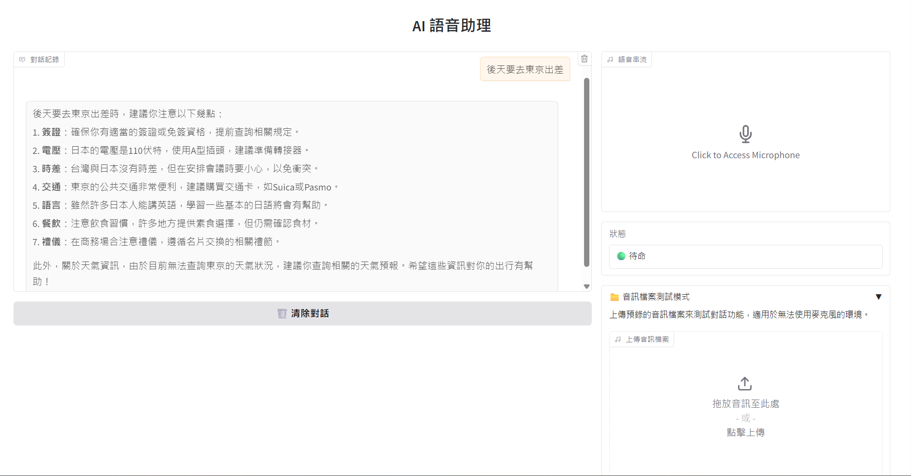

# AI Voice Assistant

基於 FastRTC 的中文語音助理，支援即時語音對話、智慧工具查詢與**多代理協作 (Multi-Agent)** 任務處理。



## 功能特色

### 核心能力

- **即時語音對話** - 使用 WebRTC 實現低延遲語音串流
- **即時對話顯示** - ASR 辨識結果與 AI 回應文字即時顯示於瀏覽器
- **中文語音辨識** - 基於 faster-whisper 的本地 ASR
- **中文語音合成** - 使用 Kokoro TTS 產生自然語音
- **LangGraph 流程編排** - 意圖分類、多步驟流程與 SubGraph 架構
- **多代理協作** - Supervisor 協調多個專家 Agent 並行處理複雜任務

### 架構演進

| 架構層級 | 技術實現 | 狀態 |
|----------|----------|------|
| **Tool 呼叫** | OpenAI Function Calling | ✅ 完成 |
| **LangGraph Flow** | StateGraph + 意圖路由 + SubGraph | ✅ 完成 |
| **Multi-Agent** | Supervisor + 專家 Agent 並行協作 | ✅ 完成 |

### Multi-Agent 協作範例

> 💬 **「後天要去東京出差」**

系統自動拆解為 3 個並行任務：

```
┌─────────────────┐     ┌─────────────────┐     ┌─────────────────┐
│  WeatherAgent   │     │  FinanceAgent   │     │  GeneralAgent   │
│   查詢東京天氣   │     │  查詢日圓匯率   │     │  出差注意事項   │
└────────┬────────┘     └────────┬────────┘     └────────┬────────┘
         │                       │                       │
         └───────────────────────┼───────────────────────┘
                                 ▼
                    ┌─────────────────────────┐
                    │     Supervisor 彙整      │
                    │  → 自然語言完整回應      │
                    └─────────────────────────┘
```

### 支援的查詢功能

| 功能 | 說明 | 範例 |
|------|------|------|
| 天氣查詢 | 查詢台灣及國際城市天氣 | 「台北今天天氣如何？」 |
| 匯率換算 | 支援多種貨幣換算 | 「100 美金換台幣多少？」 |
| 股價查詢 | 台股、美股即時報價 | 「台積電現在多少錢？」 |
| 旅遊規劃 | 根據天氣推薦景點 | 「我想去高雄玩」 |
| 出差助理 | 天氣+匯率+注意事項 | 「後天要去東京出差」 |

## 快速開始

### 使用 Docker（推薦）

```bash
# 複製環境設定
cp .env.example .env

# 設定 OpenAI API Key（編輯 .env）

# 啟動服務
docker compose up -d

# 開啟瀏覽器 http://localhost:7860
```

### 本地開發

```bash
# 建立虛擬環境並安裝依賴
uv sync

# 複製並設定環境變數
cp .env.example .env

# 啟動服務
uv run python -m voice_assistant.main

# 開啟瀏覽器 http://localhost:7860
```

## 開發指南

### 專案結構

```
ai-voice-assistant-fastrtc/
├── src/voice_assistant/
│   ├── main.py              # 應用程式入口
│   ├── config.py            # 設定管理
│   ├── llm/                 # LLM 客戶端
│   ├── tools/               # 查詢工具（天氣/匯率/股價）
│   ├── flows/               # LangGraph 流程模組
│   │   ├── state.py         # 流程狀態定義
│   │   ├── graphs/          # 流程圖（main_router, travel_planner）
│   │   └── nodes/           # 流程節點（classifier, tool_executor...）
│   ├── agents/              # 多代理協作模組（Supervisor + 專家 Agent）
│   └── voice/               # 語音處理（ASR/TTS/Handler）
├── tests/
│   ├── unit/                # 單元測試
│   └── smoke/               # Smoke Test
├── specs/                   # 規格文件（Spec-Kit）
├── docs/                    # 專案文件
├── Dockerfile
├── compose.yaml
└── pyproject.toml
```

### 執行測試

```bash
# 單元測試
uv run pytest tests/unit/ -v

# Smoke Test（需網路連線）
uv run pytest tests/smoke/ -v
```

### 程式碼品質

```bash
# 檢查與格式化
uv run ruff check . && uv run ruff format .
```

## 環境變數

| 變數 | 說明 | 預設值 |
|------|------|--------|
| `OPENAI_API_KEY` | OpenAI API 金鑰 | (必填) |
| `OPENAI_MODEL` | LLM 模型 | `gpt-4o-mini` |
| `WHISPER_MODEL_SIZE` | ASR 模型大小 | `small` |
| `TTS_VOICE` | TTS 音色 | `zf_001` |
| `SERVER_PORT` | 服務埠號 | `7860` |
| `FLOW_MODE` | 流程模式 (`multi_agent`/`langgraph`/`tools`) | `multi_agent` |

完整設定請參考 `.env.example`。

## 技術架構

```
┌───────────────────────────────────────────────────────────────┐
│                      Gradio WebRTC UI                          │
│           ┌─────────────┬──────────────────┐                  │
│           │  Chatbot    │  Status Display  │                  │
│           │ (對話記錄)  │  (狀態指示器)    │                  │
│           └─────────────┴──────────────────┘                  │
└─────────────────────────┬─────────────────────────────────────┘
                          │ Audio Stream + AdditionalOutputs
                          ▼
┌───────────────────────────────────────────────────────────────┐
│                      FastRTC Stream                            │
│                 (ReplyOnPause Handler)                         │
└─────────────────────────┬─────────────────────────────────────┘
                          │
            ┌─────────────┼─────────────┐
            ▼             ▼             ▼
       ┌─────────┐  ┌──────────┐  ┌─────────┐
       │   ASR   │  │   LLM    │  │   TTS   │
       │ Whisper │  │  OpenAI  │  │ Kokoro  │
       └─────────┘  └────┬─────┘  └─────────┘
                         │
                         ▼ FLOW_MODE 切換
         ┌───────────────┼───────────────┐
         │               │               │
         ▼               ▼               ▼
  ┌─────────────┐ ┌─────────────┐ ┌─────────────┐
  │ multi_agent │ │  langgraph  │ │    tools    │
  │   (預設)    │ │             │ │             │
  └──────┬──────┘ └──────┬──────┘ └──────┬──────┘
         │               │               │
         ▼               │               │
┌────────────────────────┼───────────────┼──────────────────────┐
│  Multi-Agent Executor  │               │                      │
│ ┌─────────────────────────────────────────────────────────┐  │
│ │                   SupervisorAgent                        │  │
│ │             (任務拆解 + 結果彙整)                        │  │
│ └───────────────────────┬─────────────────────────────────┘  │
│                         │ Send() 並行分派                     │
│      ┌──────────────────┼──────────────────┐                 │
│      ▼                  ▼                  ▼                 │
│ ┌──────────┐     ┌──────────┐      ┌──────────┐             │
│ │ Weather  │     │ Finance  │      │  Travel  │    ...      │
│ │  Agent   │     │  Agent   │      │  Agent   │             │
│ └────┬─────┘     └────┬─────┘      └────┬─────┘             │
└──────┼────────────────┼─────────────────┼────────────────────┘
       │                │                 │
       └────────────────┼─────────────────┘
                        ▼
┌───────────────────────────────────────────────────────────────┐
│                        External APIs                           │
│       ┌─────────┐    ┌─────────┐    ┌─────────┐               │
│       │ 天氣API │    │ 匯率API │    │ 股價API │               │
│       └─────────┘    └─────────┘    └─────────┘               │
└───────────────────────────────────────────────────────────────┘
```

## 擴展開發

### 新增工具

1. 在 `src/voice_assistant/tools/` 建立新工具類別，繼承 `BaseTool`
2. 實作 `name`、`description`、`parameters`、`execute` 方法
3. 在 `__init__.py` 匯出並註冊至 `ToolRegistry`
4. 更新 `SYSTEM_PROMPT` 加入工具使用說明

可參考現有工具實作：`weather.py`、`exchange_rate.py`、`stock_price.py`

### 可擴展方向

- **更多查詢工具** - 翻譯、計算機、日曆、新聞等
- **多語言支援** - 英文、日文語音辨識與合成
- **持久化對話記憶** - 儲存對話歷史至資料庫
- **使用者認證** - 多用戶支援與個人化設定

## 文件

- [專案規劃](docs/project-plan.md) - 架構設計與開發階段說明

## 授權

MIT License
