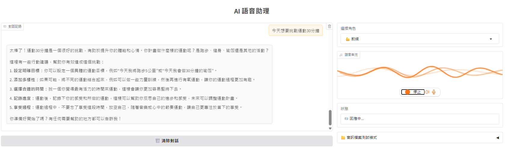
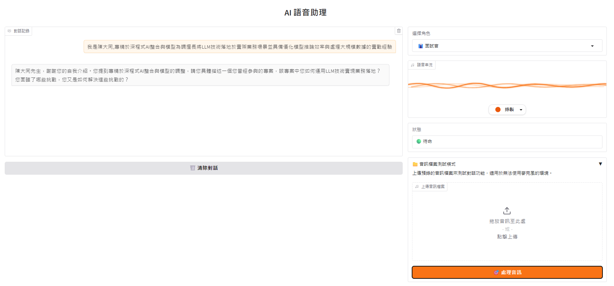
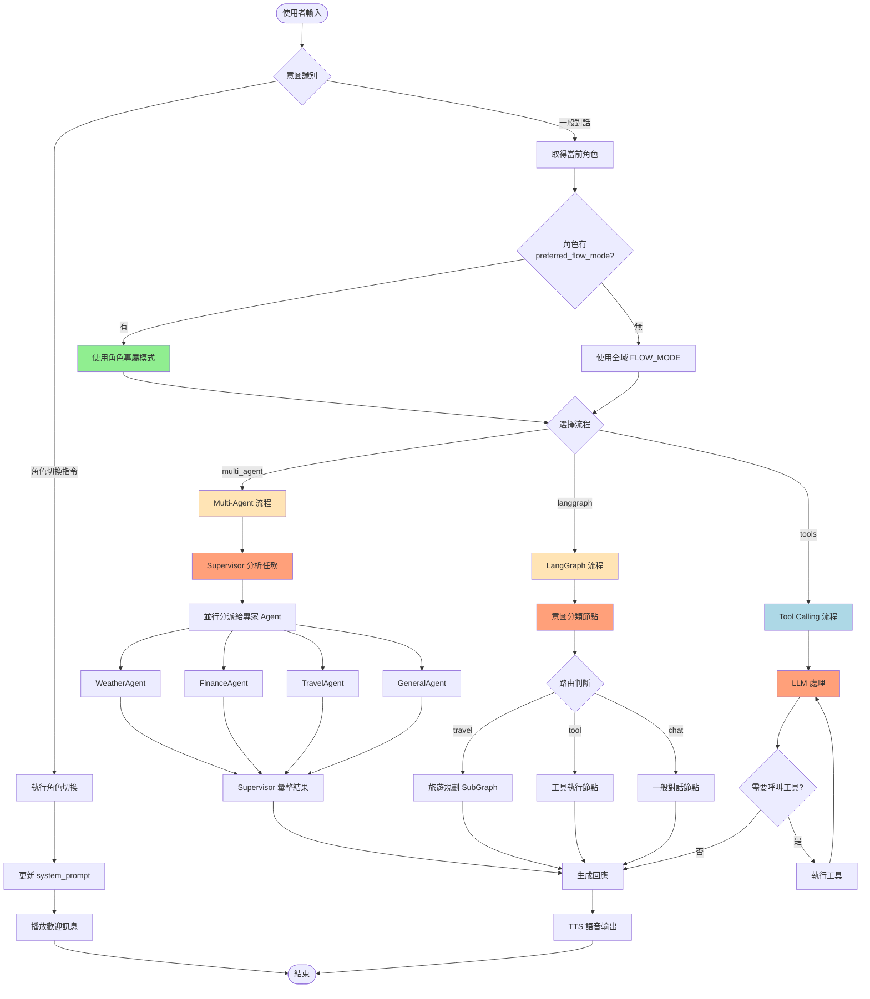

# AI Voice Assistant

基於 FastRTC 的中文語音助理，支援即時語音對話、智慧工具查詢與**多代理協作 (Multi-Agent)** 任務處理。

## ✨ 功能特色

### 🚀 超強核心能力

- **⚡ 流暢語音對話** - WebRTC 技術打造低延遲的自然溝通體驗
- **💬 實時對話秀** - 語音轉文字 + AI 回應雙軸呈現，互動更流暢
- **🧠 超準中文識別** - faster-whisper 本地化 ASR，口音、語速全搞懂
- **🎢 自然語音合成** - Kokoro TTS 讓 AI 說話像真人一樣順暢自然
- **🎭 一秒變身系統** - 從助理到面試官，語音或 UI 點擊瞬間切換角色
- **🔄 LangGraph 智慧流程** - 意圖自動分類，多步驟任務一氣呵成
- **👥 多兵種協作** - Supervisor 統帥專家 Agent 天團，並行處理複雜任務

### 🤖 超級助理
智慧管家陪你聊，天氣匯率全搞定，旅行規劃一站到位！


### 💪 個人成長教練
私人 AI 教練 24/7 在線，目標拆解、進度追蹤，讓你每天都在進步！


### 👔 面試特訓官
真實面試場景重現，即時回饋讓你自信滿滿，Offer 拿到手軟！


### 🏗️ 四代架構進化史

| 架構世代 | 核心技術 | 🎯 解決痛點 | 狀態 |
|----------|----------|-------------|------|
| **V1 工具呼叫** | OpenAI Function Calling | 基礎功能實現 | ✅ 完美運行 |
| **V2 流程編排** | StateGraph + 智慧路由 | 複雜邏輯處理 | ✅ 流暢無阻 |
| **V3 多兵協作** | Supervisor + 專家 Agent | 超級任務拆解 | ✅ 強力登場 |
| **V4 角色切換** | 動態 Prompt + 意圖路由 | 場景化 AI 互動 | ✅ 變身無極限 |

### 🎯 超強協作實戰

> 💬 **一句話搞定複雜任務：「後天要去東京出差」**

系統瞬間啟動多線作戰，3 個專家 Agent 並行處理：

```
🌤️ 天氣特務          💰 財經顧問          🎯 智慧管家
┌─────────────────┐ ┌─────────────────┐ ┌─────────────────┐
│  WeatherAgent   │ │  FinanceAgent   │ │  GeneralAgent   │
│   東京氣象偵查   │ │   日圓匯率分析   │ │   出差攻略規劃   │
└────────┬────────┘ └────────┬────────┘ └────────┬────────┘
         │                    │                    │
         └────────────────────┼────────────────────┘
                              ▼
                    ┌─────────────────────────┐
                    │ 🎖️ 總指揮官 Supervisor   │
                    │    → 完美答案一鍵生成   │
                    └─────────────────────────┘
```

### 🔥 神級功能一覽

| 超能力 | 🎯 功能說明 | 💬 一句話搞定 |
|--------|-----------|-------------|
| 🌤️ 氣象大師 | 全球城市天氣即時查詢 | 「台北今天要不要帶傘？」 |
| 💰 匯率神算子 | 多國貨幣秒速換算 | 「100 美金能買多少珍珠奶茶？」 |
| 📈 股市雷達 | 台股美股即時追蹤 | 「台積電今天漲了還是跌了？」 |
| ✈️ 旅遊規劃師 | 天氣景點智能推薦 | 「週末想去高雄哪裡玩？」 |
| 🎯 出差全能王 | 天氣+匯率+攻略全包 | 「我要去東京出差，幫我準備」 |

## 快速開始

### 使用 Docker（推薦）

```bash
# 複製環境設定
cp .env.example .env

# 設定 OpenAI API Key（編輯 .env）

# 啟動服務
docker compose up -d

# 開啟瀏覽器 http://localhost:7860
```

### 本地開發

```bash
# 建立虛擬環境並安裝依賴
uv sync

# 複製並設定環境變數
cp .env.example .env

# 啟動服務
uv run python -m voice_assistant.main

# 開啟瀏覽器 http://localhost:7860
```

## 開發指南

### 專案結構

```
ai-voice-assistant-fastrtc/
├── src/voice_assistant/
│   ├── main.py              # 應用程式入口
│   ├── config.py            # 設定管理
│   ├── llm/                 # LLM 客戶端
│   ├── tools/               # 查詢工具（天氣/匯率/股價）
│   ├── roles/               # 角色切換系統（面試官/助理/教練）
│   │   ├── schemas.py       # 角色資料模型
│   │   ├── registry.py      # 角色註冊管理
│   │   ├── intent.py        # 意圖識別
│   │   └── predefined/      # 預設角色定義
│   ├── flows/               # LangGraph 流程模組
│   │   ├── state.py         # 流程狀態定義
│   │   ├── graphs/          # 流程圖（main_router, travel_planner）
│   │   └── nodes/           # 流程節點（classifier, tool_executor...）
│   ├── agents/              # 多代理協作模組（Supervisor + 專家 Agent）
│   └── voice/               # 語音處理（ASR/TTS/Handler）
├── tests/
│   ├── unit/                # 單元測試
│   └── smoke/               # Smoke Test
├── specs/                   # 規格文件（Spec-Kit）
│   ├── 006-langgraph-flow/  # LangGraph 流程規格
│   ├── 007-multi-agent/     # 多代理協作規格
│   └── 008-role-switching/  # 角色切換規格
├── docs/                    # 專案文件
├── Dockerfile
├── compose.yaml
└── pyproject.toml
```

### 執行測試

```bash
# 單元測試
uv run pytest tests/unit/ -v

# Smoke Test（需網路連線）
uv run pytest tests/smoke/ -v
```

### 程式碼品質

```bash
# 檢查與格式化
uv run ruff check . && uv run ruff format .
```

## 環境變數

| 變數 | 說明 | 預設值 |
|------|------|--------|
| `OPENAI_API_KEY` | OpenAI API 金鑰 | (必填) |
| `OPENAI_MODEL` | LLM 模型 | `gpt-4o-mini` |
| `WHISPER_MODEL_SIZE` | ASR 模型大小 | `small` |
| `TTS_VOICE` | TTS 音色 | `zf_001` |
| `SERVER_PORT` | 服務埠號 | `7860` |
| `FLOW_MODE` | 流程模式 (`multi_agent`/`langgraph`/`tools`) | `multi_agent` |

完整設定請參考 `.env.example`。

## 技術架構

### 整體系統架構

```
┌───────────────────────────────────────────────────────────────┐
│                      Gradio WebRTC UI                          │
│           ┌─────────────┬──────────────────┐                  │
│           │  Chatbot    │  Status Display  │                  │
│           │ (對話記錄)  │  (狀態指示器)    │                  │
│           └─────────────┴──────────────────┘                  │
└─────────────────────────┬─────────────────────────────────────┘
                          │ Audio Stream + AdditionalOutputs
                          ▼
┌───────────────────────────────────────────────────────────────┐
│                      FastRTC Stream                            │
│                 (ReplyOnPause Handler)                         │
└─────────────────────────┬─────────────────────────────────────┘
                          │
            ┌─────────────┼─────────────┐
            ▼             ▼             ▼
       ┌─────────┐  ┌──────────┐  ┌─────────┐
       │   ASR   │  │   LLM    │  │   TTS   │
       │ Whisper │  │  OpenAI  │  │ Kokoro  │
       └─────────┘  └────┬─────┘  └─────────┘
                         │
                         ▼ FLOW_MODE 切換
         ┌───────────────┼───────────────┐
         │               │               │
         ▼               ▼               ▼
  ┌─────────────┐ ┌─────────────┐ ┌─────────────┐
  │ multi_agent │ │  langgraph  │ │    tools    │
  │   (預設)    │ │             │ │             │
  └──────┬──────┘ └──────┬──────┘ └──────┬──────┘
         │               │               │
         ▼               │               │
┌────────────────────────┼───────────────┼──────────────────────┐
│  Multi-Agent Executor  │               │                      │
│ ┌─────────────────────────────────────────────────────────┐  │
│ │                   SupervisorAgent                        │  │
│ │             (任務拆解 + 結果彙整)                        │  │
│ │ └───────────────────────┬─────────────────────────────────┘  │
│                         │ Send() 並行分派                     │
│      ┌──────────────────┼──────────────────┐                 │
│      ▼                  ▼                  ▼                 │
│ ┌──────────┐     ┌──────────┐      ┌──────────┐             │
│ │ Weather  │     │ Finance  │      │  Travel  │    ...      │
│ │  Agent   │     │  Agent   │      │  Agent   │             │
│ └────┬─────┘     └────┬─────┘      └────┬─────┘             │
└──────┼────────────────┼─────────────────┼────────────────────┘
       │                │                 │
       └────────────────┼─────────────────┘
                        ▼
┌───────────────────────────────────────────────────────────────┐
│                        External APIs                           │
│       ┌─────────┐    ┌─────────┐    ┌─────────┐               │
│       │ 天氣API │    │ 匯率API │    │ 股價API │               │
│       └─────────┘    └─────────┘    └─────────┘               │
└───────────────────────────────────────────────────────────────┘
```

### 角色切換與流程模式選擇

系統支援**角色切換功能 (008-role-switching)**，不同角色可使用不同的處理流程：



### 角色與流程模式對應

| 角色 | preferred_flow_mode | 適用場景 | 說明 |
|------|---------------------|----------|------|
| **助理** (assistant) | `multi_agent` | 任務導向查詢 | 智能分派任務給專家 Agent，適合「後天去東京」這類需要多重資訊的查詢 |
| **面試官** (interviewer) | `tools` | 對話互動 | 深度追問、連貫對話，適合面試練習場景 |
| **教練** (coach) | `tools` | 對話互動 | 引導式對話、建議回饋，適合教練場景 |

### 流程模式詳細說明

#### 1. Multi-Agent 模式（任務導向）

**適用場景**: 需要查詢多種資訊並整合的複雜任務

**工作流程**:
1. Supervisor 分析使用者需求
2. 拆解成多個子任務
3. 使用 `Send()` 並行分派給專家 Agent
4. 各 Agent 獨立執行查詢（天氣、匯率、股價等）
5. Supervisor 彙整所有結果
6. 生成自然語言完整回應

**優點**: 智能路由、專業分工、並行處理
**缺點**: 對話較生硬，不適合需要連貫互動的場景

#### 2. LangGraph 模式（流程編排）

**適用場景**: 需要多步驟推理和條件分支的流程

**工作流程**:
1. 意圖分類節點判斷使用者意圖
2. 根據意圖路由到不同處理分支
3. 使用 SubGraph 處理複雜子流程（如旅遊規劃）
4. 狀態機管理對話狀態
5. 生成回應

**優點**: 流程可視化、狀態管理清晰、支援複雜分支邏輯
**缺點**: 配置複雜、學習曲線陡

#### 3. Tool Calling 模式（對話導向）

**適用場景**: 需要自然對話互動的場景（面試、教練、一般聊天）

**工作流程**:
1. LLM 直接處理使用者輸入
2. 根據 system_prompt 判斷是否需要工具
3. 如需要，呼叫對應工具（Function Calling）
4. 整合工具結果繼續對話
5. 生成自然回應

**優點**: 對話自然、回應連貫、配置簡單
**缺點**: 複雜任務處理能力較弱

## 擴展開發

### 新增工具

1. 在 `src/voice_assistant/tools/` 建立新工具類別，繼承 `BaseTool`
2. 實作 `name`、`description`、`parameters`、`execute` 方法
3. 在 `__init__.py` 匯出並註冊至 `ToolRegistry`
4. 更新 `SYSTEM_PROMPT` 加入工具使用說明

可參考現有工具實作：`weather.py`、`exchange_rate.py`、`stock_price.py`

### 可擴展方向

- **更多查詢工具** - 翻譯、計算機、日曆、新聞等
- **多語言支援** - 英文、日文語音辨識與合成
- **持久化對話記憶** - 儲存對話歷史至資料庫
- **使用者認證** - 多用戶支援與個人化設定

## 文件

- [專案規劃](docs/project-plan.md) - 架構設計與開發階段說明

## 授權

MIT License
