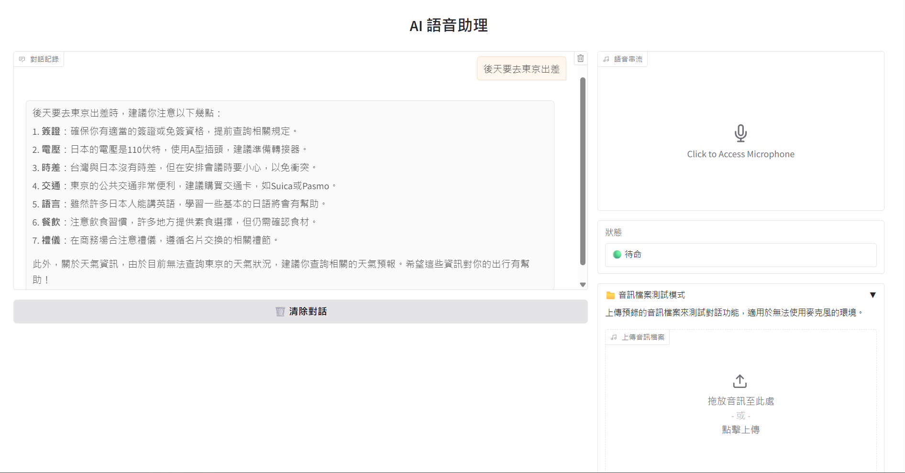
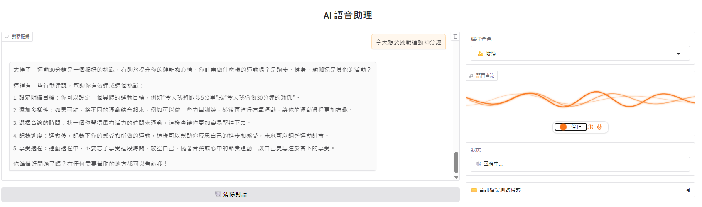
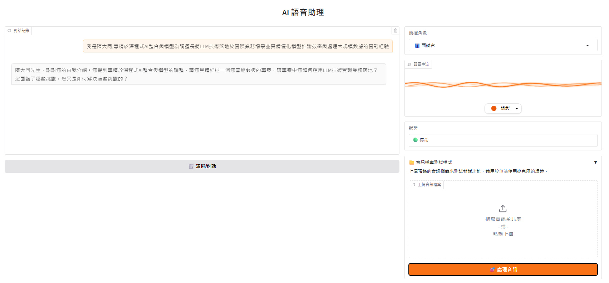
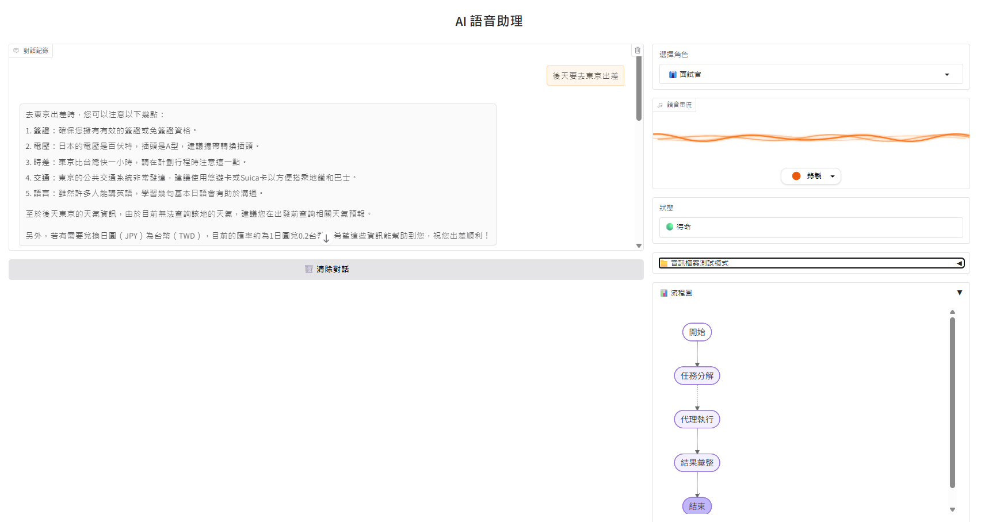
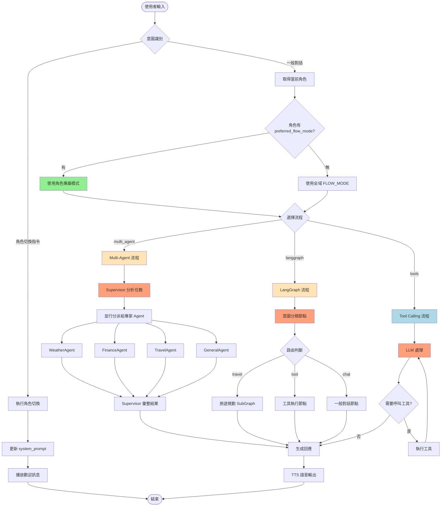

# AI Voice Assistant

基於 FastRTC 的中文語音助理，支援即時語音對話、智慧工具查詢與**多代理協作 (Multi-Agent)** 任務處理。

## ✨ 功能特色

### 🚀 超強核心能力

- **⚡ 流暢語音對話** - WebRTC 技術打造低延遲的自然溝通體驗
- **💬 實時對話秀** - 語音轉文字 + AI 回應雙軸呈現，互動更流暢
- **🧠 超準中文識別** - faster-whisper 本地化 ASR，口音、語速全搞懂
- **🎢 自然語音合成** - Kokoro TTS 讓 AI 說話像真人一樣順暢自然
- **🎭 一秒變身系統** - 從助理到面試官，語音或 UI 點擊瞬間切換角色
- **🔄 LangGraph 智慧流程** - 意圖自動分類，多步驟任務一氣呵成
- **👥 多兵種協作** - Supervisor 統帥專家 Agent 天團，並行處理複雜任務
- **🤖 AI 輔助開發** - 開發者透過 AI Agent 快速建立 LangGraph 流程與工具
- **🍽️ 智慧美食推薦** - 結合天氣與城市，精準推薦最適合的室內/戶外餐廳

### 🤖 超級助理
智慧管家陪你聊，天氣匯率全搞定，旅行規劃一站到位！



### 💪 個人成長教練
私人 AI 教練 24/7 在線，目標拆解、進度追蹤，讓你每天都在進步！


### 👔 面試特訓官
真實面試場景重現，即時回饋讓你自信滿滿，Offer 拿到手軟！



### 📊 流程圖
透過視覺化流程圖，讓我們更加理解背後的運作機制


### 🏗️ 四代架構進化史

| 架構世代 | 核心技術 | 🎯 解決痛點 | 狀態 |
|----------|----------|-------------|------|
| **V1 工具呼叫** | OpenAI Function Calling | 基礎功能實現 | ✅ 完美運行 |
| **V2 流程編排** | StateGraph + 智慧路由 | 複雜邏輯處理 | ✅ 流暢無阻 |
| **V3 多兵協作** | Supervisor + 專家 Agent | 超級任務拆解 | ✅ 強力登場 |
| **V4 角色切換** | 動態 Prompt + 意圖路由 | 場景化 AI 互動 | ✅ 變身無極限 |

### 🎯 超強協作實戰

> 💬 **一句話搞定複雜任務：「後天要去東京出差」**

系統瞬間啟動多線作戰，3 個專家 Agent 並行處理：

```
🌤️ 天氣特務          💰 財經顧問          🎯 智慧管家
┌─────────────────┐ ┌─────────────────┐ ┌─────────────────┐
│  WeatherAgent   │ │  FinanceAgent   │ │  GeneralAgent   │
│   東京氣象偵查   │ │   日圓匯率分析   │ │   出差攻略規劃   │
└────────┬────────┘ └────────┬────────┘ └────────┬────────┘
         │                    │                    │
         └────────────────────┼────────────────────┘
                              ▼
                    ┌─────────────────────────┐
                    │ 🎖️ 總指揮官 Supervisor   │
                    │    → 完美答案一鍵生成   │
                    └─────────────────────────┘

💡 其他專家 Agent 還包括：
   🍽️ FoodAgent (美食推薦)  |  ✈️ TravelAgent (旅遊規劃)
```

### 🤖 AI 輔助開發系統

> **⚠️ 開發者功能：透過 AI Agent 快速建立 LangGraph 流程**

這是**開發階段的輔助工具**，讓開發者透過內建的 **flow-builder Skill**，以自然語言描述需求，AI Agent 自動產生符合專案架構的完整流程程式碼。

**🎯 適用對象**：專案開發者（非終端使用者）

#### 🛠️ 開發者工作流程

```
開發者描述需求 → AI Agent 分析 → 自動生成程式碼 → 測試驗證 → 部署上線
```

| 階段 | AI Agent 自動處理 | 輸出成果 |
|------|------------------|----------|
| **需求解析** | 理解流程目標、步驟、資料流 | 結構化需求文件 |
| **工具盤點** | 掃描現有工具，判斷是否需要新建 | 工具複用策略 |
| **架構設計** | FlowState、節點、路由規劃 | 技術設計文件 |
| **程式碼生成** | 產生節點、StateGraph、Executor | 可運行的程式碼 |
| **測試撰寫** | 自動產生 pytest 單元測試 | 測試覆蓋率 >80% |
| **驗證部署** | Ruff 檢查、測試執行、註冊 | 立即可用的流程 |

#### 💡 開發實戰範例

**開發者輸入**：「建立一個美食推薦流程」

**AI Agent 自動完成**：
1. ✅ 建立 4 個節點（城市提取、天氣查詢、場地決策、推薦生成）
2. ✅ 設計 FoodRecommendState 狀態結構
3. ✅ 整合 WeatherTool 工具
4. ✅ 建立 FoodAgent 專家代理
5. ✅ 產生 10 個單元測試
6. ✅ 通過所有品質檢查
7. ✅ 自動註冊到 Multi-Agent 系統

**關鍵技術**：
- **工廠模式** - 依賴注入 + 閉包捕獲
- **TypedDict 狀態管理** - `total=False` 允許部分更新
- **自動發現機制** - Agent 自動註冊到 Supervisor
- **Mermaid 視覺化** - 流程圖即時生成

**📝 註記**：終端使用者直接使用語音與助理對話即可（如「台北有什麼好吃的？」），無需自行建立流程。

### 🍽️ 智慧美食推薦

> **結合天氣與城市，精準推薦最適合的室內/戶外餐廳**

透過 **Multi-Agent 協作**，美食推薦流程自動整合天氣資訊，提供最貼心的用餐建議。

#### 🌟 推薦流程

```
使用者輸入 → 提取城市 → 查詢天氣 → 場地決策 → AI 推薦
    ↓           ↓          ↓          ↓         ↓
「台北美食」  「台北」   「22°C 晴天」 「戶外」  「3-5 家餐廳」
```

#### 🎯 智慧決策邏輯

| 天氣條件 | 決策結果 | 推薦類型 |
|---------|---------|---------|
| 15-28°C + 非雨天 | 🌤️ 適合戶外 | 景觀餐廳、河畔咖啡、天台餐廳 |
| 溫度過高/過低 | 🏠 建議室內 | 購物中心、百貨美食、室內餐廳 |
| 雨天 | ☔ 建議室內 | 商圈美食、地下街、室內餐廳 |

#### 💬 實戰對話

```
使用者：「台北有什麼好吃的餐廳？」

系統執行：
1️⃣ 提取城市 → 台北
2️⃣ 查詢天氣 → 22°C 晴天
3️⃣ 決策場地 → 戶外用餐
4️⃣ AI 推薦 → 生成 3-5 家戶外餐廳

AI 回應：
「根據台北目前 22°C 的舒適天氣，推薦以下戶外餐廳：

1. 陽明山草山小鎮 - 景觀餐廳，可邊用餐邊欣賞台北夜景
2. 淡水漁人碼頭餐廳 - 海鮮料理，戶外座位可眺望淡水河
3. 內湖大湖公園湖畔咖啡 - 輕食咖啡廳，湖邊座位非常愜意

適合今天這樣的好天氣享受戶外用餐！」
```

#### 🏗️ 技術亮點

- **LangGraph 流程編排** - 4 個節點串接（LLM + Tool + Pure Function）
- **Multi-Agent 整合** - FoodAgent 自動被 Supervisor 發現與分派
- **工具複用** - 直接使用現有 WeatherTool，無需重複開發
- **錯誤處理** - 完整的異常處理（城市無法識別、天氣查詢失敗）
- **測試覆蓋** - 10 個單元測試，覆蓋所有節點與錯誤情境

### 🔥 神級功能一覽

| 超能力 | 🎯 功能說明 | 💬 一句話搞定 |
|--------|-----------|-------------|
| 🌤️ 氣象大師 | 全球城市天氣即時查詢 | 「台北今天要不要帶傘？」 |
| 💰 匯率神算子 | 多國貨幣秒速換算 | 「100 美金能買多少珍珠奶茶？」 |
| 📈 股市雷達 | 台股美股即時追蹤 | 「台積電今天漲了還是跌了？」 |
| ✈️ 旅遊規劃師 | 天氣景點智能推薦 | 「週末想去高雄哪裡玩？」 |
| 🍽️ 美食達人 | 根據天氣推薦最適合的餐廳 | 「台北有什麼好吃的餐廳？」 |
| 🎯 出差全能王 | 天氣+匯率+攻略全包 | 「我要去東京出差，幫我準備」 |
| 🤖 AI 輔助開發 | 開發者透過 AI 快速建立新流程 | （開發者功能，非使用者指令） |

## 快速開始

### 使用 Docker（推薦）

```bash
# 複製環境設定
cp .env.example .env

# 設定 OpenAI API Key（編輯 .env）

# 啟動服務
docker compose up -d

# 開啟瀏覽器 http://localhost:7860
```

### 本地開發

```bash
# 建立虛擬環境並安裝依賴
uv sync

# 複製並設定環境變數
cp .env.example .env

# 啟動服務
uv run python -m voice_assistant.main

# 開啟瀏覽器 http://localhost:7860
```

## 開發指南

### 專案結構

```
ai-voice-assistant-fastrtc/
├── src/voice_assistant/
│   ├── main.py              # 應用程式入口
│   ├── config.py            # 設定管理
│   ├── llm/                 # LLM 客戶端
│   ├── tools/               # 查詢工具（天氣/匯率/股價）
│   ├── roles/               # 角色切換系統（面試官/助理/教練）
│   │   ├── schemas.py       # 角色資料模型
│   │   ├── registry.py      # 角色註冊管理
│   │   ├── intent.py        # 意圖識別
│   │   └── predefined/      # 預設角色定義
│   ├── flows/               # LangGraph 流程模組
│   │   ├── state.py         # 流程狀態定義
│   │   ├── graphs/          # 流程圖（main_router, travel_planner, food）
│   │   ├── nodes/           # 流程節點（classifier, tool_executor, food/*）
│   │   └── food_executor.py # 美食推薦流程執行器
│   ├── agents/              # 多代理協作模組（Supervisor + 專家 Agent）
│   │   ├── supervisor.py    # 任務拆解與分派
│   │   ├── weather.py       # 天氣查詢 Agent
│   │   ├── finance.py       # 財經查詢 Agent
│   │   ├── travel.py        # 旅遊規劃 Agent
│   │   ├── food.py          # 美食推薦 Agent ⭐
│   │   └── general.py       # 通用對話 Agent
│   └── voice/               # 語音處理（ASR/TTS/Handler）
├── tests/
│   ├── unit/                # 單元測試
│   │   ├── flows/test_food.py  # 美食推薦流程測試 ⭐
│   │   └── agents/          # Agent 測試
│   └── smoke/               # Smoke Test
├── specs/                   # 規格文件（Spec-Kit）
│   ├── 006-langgraph-flow/  # LangGraph 流程規格
│   ├── 007-multi-agent/     # 多代理協作規格
│   └── 008-role-switching/  # 角色切換規格
├── .opencode/skills/        # AI Agent 開發技能
│   ├── flow-builder/        # 流程建立技能 ⭐
│   ├── commit/              # Git 提交技能
│   └── spec-driven-development/  # 規格驅動開發
├── docs/                    # 專案文件
├── Dockerfile
├── compose.yaml
└── pyproject.toml
```

### 執行測試

```bash
# 單元測試
uv run pytest tests/unit/ -v

# Smoke Test（需網路連線）
uv run pytest tests/smoke/ -v
```

### 程式碼品質

```bash
# 檢查與格式化
uv run ruff check . && uv run ruff format .
```

## 環境變數

| 變數 | 說明 | 預設值 |
|------|------|--------|
| `OPENAI_API_KEY` | OpenAI API 金鑰 | (必填) |
| `OPENAI_MODEL` | LLM 模型 | `gpt-4o-mini` |
| `WHISPER_MODEL_SIZE` | ASR 模型大小 | `small` |
| `TTS_VOICE` | TTS 音色 | `zf_001` |
| `SERVER_PORT` | 服務埠號 | `7860` |
| `FLOW_MODE` | 流程模式 (`multi_agent`/`langgraph`/`tools`) | `multi_agent` |

完整設定請參考 `.env.example`。

## 技術架構

### 整體系統架構

```
┌───────────────────────────────────────────────────────────────┐
│                      Gradio WebRTC UI                          │
│           ┌─────────────┬──────────────────┐                  │
│           │  Chatbot    │  Status Display  │                  │
│           │ (對話記錄)  │  (狀態指示器)    │                  │
│           └─────────────┴──────────────────┘                  │
└─────────────────────────┬─────────────────────────────────────┘
                          │ Audio Stream + AdditionalOutputs
                          ▼
┌───────────────────────────────────────────────────────────────┐
│                      FastRTC Stream                            │
│                 (ReplyOnPause Handler)                         │
└─────────────────────────┬─────────────────────────────────────┘
                          │
            ┌─────────────┼─────────────┐
            ▼             ▼             ▼
       ┌─────────┐  ┌──────────┐  ┌─────────┐
       │   ASR   │  │   LLM    │  │   TTS   │
       │ Whisper │  │  OpenAI  │  │ Kokoro  │
       └─────────┘  └────┬─────┘  └─────────┘
                         │
                         ▼ FLOW_MODE 切換
         ┌───────────────┼───────────────┐
         │               │               │
         ▼               ▼               ▼
  ┌─────────────┐ ┌─────────────┐ ┌─────────────┐
  │ multi_agent │ │  langgraph  │ │    tools    │
  │   (預設)    │ │             │ │             │
  └──────┬──────┘ └──────┬──────┘ └──────┬──────┘
         │               │               │
         ▼               │               │
┌────────────────────────┼───────────────┼──────────────────────┐
│  Multi-Agent Executor  │               │                      │
│ ┌─────────────────────────────────────────────────────────┐  │
│ │                   SupervisorAgent                        │  │
│ │             (任務拆解 + 結果彙整)                        │  │
│ │ └───────────────────────┬─────────────────────────────────┘  │
│                         │ Send() 並行分派                     │
│      ┌──────────────────┼──────────────────┐                 │
│      ▼                  ▼                  ▼                 │
│ ┌──────────┐     ┌──────────┐      ┌──────────┐             │
│ │ Weather  │     │ Finance  │      │  Travel  │             │
│ │  Agent   │     │  Agent   │      │  Agent   │             │
│ └────┬─────┘     └────┬─────┘      └────┬─────┘             │
│      ▼                ▼                  ▼                   │
│ ┌──────────┐     ┌──────────┐      ...                      │
│ │   Food   │     │ General  │                               │
│ │  Agent   │     │  Agent   │                               │
│ └────┬─────┘     └────┬─────┘                               │
└──────┼────────────────┼─────────────────┼────────────────────┘
       │                │                 │
       └────────────────┼─────────────────┘
                        ▼
┌───────────────────────────────────────────────────────────────┐
│                        External APIs                           │
│       ┌─────────┐    ┌─────────┐    ┌─────────┐               │
│       │ 天氣API │    │ 匯率API │    │ 股價API │               │
│       └─────────┘    └─────────┘    └─────────┘               │
└───────────────────────────────────────────────────────────────┘
```

### 角色切換與流程模式選擇

系統支援**角色切換功能 (008-role-switching)**，不同角色可使用不同的處理流程：


```mermaid
flowchart TD
    Start([使用者輸入]) --> CheckIntent{意圖識別}
    
    CheckIntent -->|角色切換指令| SwitchRole[執行角色切換]
    SwitchRole --> UpdatePrompt[更新 system_prompt]
    UpdatePrompt --> PlayWelcome[播放歡迎訊息]
    PlayWelcome --> End([結束])
    
    CheckIntent -->|一般對話| GetRole[取得當前角色]
    GetRole --> CheckPreferred{角色有<br/>preferred_flow_mode?}
    
    CheckPreferred -->|有| UseRoleMode[使用角色專屬模式]
    CheckPreferred -->|無| UseGlobalMode[使用全域 FLOW_MODE]
    
    UseRoleMode --> SelectFlow{選擇流程}
    UseGlobalMode --> SelectFlow
    
    SelectFlow -->|multi_agent| MultiAgent[Multi-Agent 流程]
    SelectFlow -->|langgraph| LangGraph[LangGraph 流程]
    SelectFlow -->|tools| Tools[Tool Calling 流程]
    
    MultiAgent --> MA_Supervisor[Supervisor 分析任務]
    MA_Supervisor --> MA_Dispatch[並行分派給專家 Agent]
    MA_Dispatch --> MA_Weather[WeatherAgent]
    MA_Dispatch --> MA_Finance[FinanceAgent]
    MA_Dispatch --> MA_Travel[TravelAgent]
    MA_Dispatch --> MA_General[GeneralAgent]
    MA_Weather --> MA_Merge[Supervisor 彙整結果]
    MA_Finance --> MA_Merge
    MA_Travel --> MA_Merge
    MA_General --> MA_Merge
    MA_Merge --> Response[生成回應]
    
    LangGraph --> LG_Classify[意圖分類節點]
    LG_Classify --> LG_Route{路由判斷}
    LG_Route -->|travel| LG_Travel[旅遊規劃 SubGraph]
    LG_Route -->|tool| LG_Tool[工具執行節點]
    LG_Route -->|chat| LG_Chat[一般對話節點]
    LG_Travel --> Response
    LG_Tool --> Response
    LG_Chat --> Response
    
    Tools --> T_LLM[LLM 處理]
    T_LLM --> T_Check{需要呼叫工具?}
    T_Check -->|是| T_Execute[執行工具]
    T_Execute --> T_LLM
    T_Check -->|否| Response
    
    Response --> TTS[TTS 語音輸出]
    TTS --> End
    
    style UseRoleMode fill:#90EE90
    style MultiAgent fill:#FFE4B5
    style LangGraph fill:#FFE4B5
    style Tools fill:#ADD8E6
    style MA_Supervisor fill:#FFA07A
    style LG_Classify fill:#FFA07A
    style T_LLM fill:#FFA07A
```

### 角色與流程模式對應

| 角色 | preferred_flow_mode | 適用場景 | 說明 |
|------|---------------------|----------|------|
| **助理** (assistant) | `multi_agent` | 任務導向查詢 | 智能分派任務給專家 Agent，適合「後天去東京」這類需要多重資訊的查詢 |
| **面試官** (interviewer) | `tools` | 對話互動 | 深度追問、連貫對話，適合面試練習場景 |
| **教練** (coach) | `tools` | 對話互動 | 引導式對話、建議回饋，適合教練場景 |

### 流程模式詳細說明

#### 1. Multi-Agent 模式（任務導向）

**適用場景**: 需要查詢多種資訊並整合的複雜任務

**工作流程**:
1. Supervisor 分析使用者需求
2. 拆解成多個子任務
3. 使用 `Send()` 並行分派給專家 Agent
4. 各 Agent 獨立執行查詢（天氣、匯率、股價等）
5. Supervisor 彙整所有結果
6. 生成自然語言完整回應

**優點**: 智能路由、專業分工、並行處理
**缺點**: 對話較生硬，不適合需要連貫互動的場景

#### 2. LangGraph 模式（流程編排）

**適用場景**: 需要多步驟推理和條件分支的流程

**工作流程**:
1. 意圖分類節點判斷使用者意圖
2. 根據意圖路由到不同處理分支
3. 使用 SubGraph 處理複雜子流程（如旅遊規劃）
4. 狀態機管理對話狀態
5. 生成回應

**優點**: 流程可視化、狀態管理清晰、支援複雜分支邏輯
**缺點**: 配置複雜、學習曲線陡

#### 3. Tool Calling 模式（對話導向）

**適用場景**: 需要自然對話互動的場景（面試、教練、一般聊天）

**工作流程**:
1. LLM 直接處理使用者輸入
2. 根據 system_prompt 判斷是否需要工具
3. 如需要，呼叫對應工具（Function Calling）
4. 整合工具結果繼續對話
5. 生成自然回應

**優點**: 對話自然、回應連貫、配置簡單
**缺點**: 複雜任務處理能力較弱

## 擴展開發

### 新增工具

1. 在 `src/voice_assistant/tools/` 建立新工具類別，繼承 `BaseTool`
2. 實作 `name`、`description`、`parameters`、`execute` 方法
3. 在 `__init__.py` 匯出並註冊至 `ToolRegistry`
4. 更新 `SYSTEM_PROMPT` 加入工具使用說明

可參考現有工具實作：`weather.py`、`exchange_rate.py`、`stock_price.py`

### 新增 AI 流程（開發者功能）

⚠️ **此功能供開發者使用**，透過 **flow-builder Skill** 與 AI Agent 協作開發新流程。

透過 AI Agent 輔助，只需描述需求，自動產生完整流程：

```bash
# 開發者與 AI Agent 對話建立流程
「建立一個電影推薦流程：
1. 詢問使用者喜歡的類型
2. 查詢熱門電影資料
3. 根據評分和類型推薦 3 部電影」

# AI Agent 自動完成：
# ✅ 設計 MovieRecommendState
# ✅ 建立 4 個節點（類型提取、電影查詢、評分過濾、推薦生成）
# ✅ 產生 MovieAgent 專家代理
# ✅ 撰寫單元測試
# ✅ 通過品質檢查
# ✅ 自動註冊到系統
```

**技術細節**：
- 遵循 BaseFlowExecutor + FlowRegistry 架構
- 工廠模式 + 閉包注入依賴
- TypedDict `total=False` 狀態管理
- 自動整合到 Multi-Agent 系統

### 可擴展方向

- **更多查詢工具** - 翻譯、計算機、日曆、新聞等
- **更多智慧流程** - 電影推薦、健身計畫、學習路徑等（開發者可透過 AI 輔助開發系統快速建立）
- **多語言支援** - 英文、日文語音辨識與合成
- **持久化對話記憶** - 儲存對話歷史至資料庫
- **使用者認證** - 多用戶支援與個人化設定

## 文件

- [專案規劃](docs/project-plan.md) - 架構設計與開發階段說明

## 授權

MIT License
