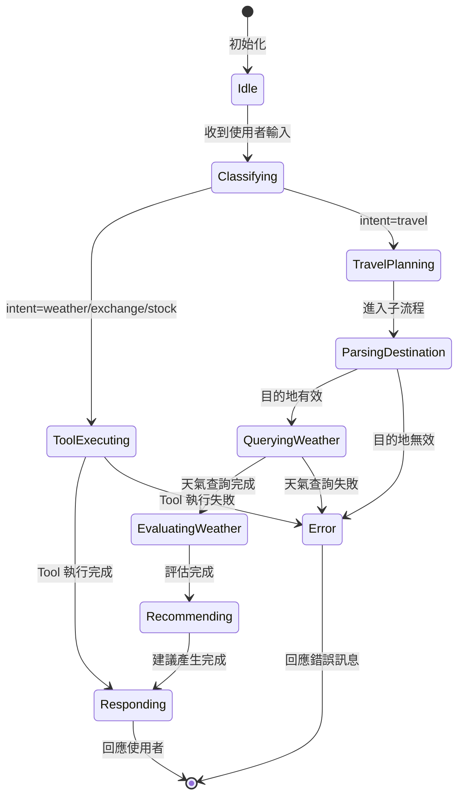

# Data Model: LangGraph Travel Flow

**Date**: 2026-01-04
**Purpose**: 定義流程狀態與實體的資料結構

## 核心狀態模型

### FlowState（主流程狀態）

主流程的共享狀態，在所有節點間傳遞。

```python
from typing import TypedDict, Literal
from pydantic import BaseModel

class FlowState(TypedDict, total=False):
    """LangGraph 主流程狀態"""

    # 輸入
    user_input: str                    # 使用者原始輸入文字

    # 意圖分類
    intent: IntentType                 # 分類後的意圖類型

    # Tool 執行結果
    tool_name: str | None              # 呼叫的 Tool 名稱
    tool_args: dict | None             # Tool 參數
    tool_result: dict | None           # Tool 執行結果

    # 旅遊規劃（由子流程填充）
    travel_state: TravelPlanState | None

    # 輸出
    response: str                      # 最終回應文字
    error: str | None                  # 錯誤訊息（如有）
```

**欄位說明**:

| 欄位 | 類型 | 必填 | 說明 |
|------|------|------|------|
| `user_input` | str | ✅ | 使用者輸入的原始文字 |
| `intent` | IntentType | ✅ | 意圖分類結果 |
| `tool_name` | str \| None | ❌ | 天氣/匯率/股票查詢時使用 |
| `tool_args` | dict \| None | ❌ | Tool 呼叫參數 |
| `tool_result` | dict \| None | ❌ | Tool 執行結果 |
| `travel_state` | TravelPlanState \| None | ❌ | 旅遊流程專用狀態 |
| `response` | str | ✅ | 最終回應給使用者的文字 |
| `error` | str \| None | ❌ | 錯誤訊息 |

---

### IntentType（意圖類型）

使用者意圖的列舉類型。

```python
from typing import Literal

IntentType = Literal["weather", "exchange", "stock", "travel"]
```

**類型說明**:

| 類型 | 說明 | 路由目標 |
|------|------|----------|
| `weather` | 天氣查詢 | WeatherTool |
| `exchange` | 匯率換算 | ExchangeRateTool |
| `stock` | 股票查詢 | StockPriceTool |
| `travel` | 旅遊規劃 | TravelPlannerSubGraph |

**意圖識別關鍵詞**（供 LLM 參考）:

| 意圖 | 觸發詞範例 |
|------|-----------|
| travel | 「我想去...玩」「想去...旅遊」「想去...走走」「規劃...行程」 |
| weather | 「天氣」「氣溫」「溫度」「會下雨嗎」 |
| exchange | 「匯率」「換台幣」「換美金」「多少錢」（貨幣相關） |
| stock | 「股價」「股票」「多少錢」（股票相關） |

---

### TravelPlanState（旅遊規劃狀態）

旅遊規劃子流程的專用狀態。

```python
from typing import TypedDict
from pydantic import BaseModel

class TravelPlanState(TypedDict, total=False):
    """旅遊規劃子流程狀態"""

    # 目的地解析
    destination: str | None            # 解析後的目的地城市
    destination_valid: bool            # 是否為支援的城市

    # 天氣資訊
    weather_data: WeatherInfo | None   # 天氣查詢結果
    weather_suitable: bool | None      # 天氣是否適合出遊

    # 建議
    recommendation_type: RecommendationType | None  # 建議類型
    recommendations: list[str]         # 景點/活動建議清單
```

**欄位說明**:

| 欄位 | 類型 | 必填 | 說明 |
|------|------|------|------|
| `destination` | str \| None | ❌ | 解析後的城市名稱 |
| `destination_valid` | bool | ❌ | 是否為支援的台灣城市 |
| `weather_data` | WeatherInfo \| None | ❌ | 天氣 API 回傳資料 |
| `weather_suitable` | bool \| None | ❌ | True=適合出遊, False=不適合 |
| `recommendation_type` | RecommendationType \| None | ❌ | 建議類型 |
| `recommendations` | list[str] | ❌ | 景點或活動建議清單 |

---

### WeatherInfo（天氣資訊）

天氣查詢結果的結構化資料。

```python
from pydantic import BaseModel

class WeatherInfo(BaseModel):
    """天氣資訊結構"""

    city: str                          # 城市名稱
    temperature: float                 # 氣溫（攝氏）
    weather: str                       # 天氣描述（如：晴朗、小雨）
    weather_code: int                  # WMO 天氣代碼
    humidity: float | None = None      # 濕度（%）
    wind_speed: float | None = None    # 風速（km/h）
```

**天氣適合出遊判斷邏輯**:
```python
def is_weather_suitable(weather_info: WeatherInfo) -> bool:
    """判斷天氣是否適合出遊"""
    # 下雨天氣代碼：51-67, 80-82, 95-99
    rainy_codes = set(range(51, 68)) | set(range(80, 83)) | set(range(95, 100))

    # 條件：非雨天 且 氣溫介於 15-35°C
    is_not_rainy = weather_info.weather_code not in rainy_codes
    is_comfortable_temp = 15 <= weather_info.temperature <= 35

    return is_not_rainy and is_comfortable_temp
```

---

### RecommendationType（建議類型）

旅遊建議的類型列舉。

```python
from typing import Literal

RecommendationType = Literal["outdoor", "indoor", "alternative_date"]
```

| 類型 | 說明 | 觸發條件 |
|------|------|----------|
| `outdoor` | 戶外活動建議 | 天氣適合出遊 |
| `indoor` | 室內活動建議 | 天氣不適合（下雨） |
| `alternative_date` | 建議改天出遊 | 天氣不適合（極端氣溫） |

---

## 靜態資料

### 城市景點推薦清單

```python
CITY_RECOMMENDATIONS: dict[str, dict[str, list[str]]] = {
    "台北": {
        "outdoor": ["象山步道", "陽明山國家公園", "淡水老街", "北投溫泉"],
        "indoor": ["台北101觀景台", "故宮博物院", "誠品書店", "西門町"],
    },
    "高雄": {
        "outdoor": ["西子灣", "旗津海岸", "蓮池潭", "駁二藝術特區"],
        "indoor": ["夢時代購物中心", "高雄市立美術館", "三多商圈", "瑞豐夜市"],
    },
    "台中": {
        "outdoor": ["高美濕地", "彩虹眷村", "東海大學", "台中公園"],
        "indoor": ["國立自然科學博物館", "逢甲夜市", "宮原眼科", "審計新村"],
    },
    # ... 其他城市
}
```

---

## 狀態轉換圖



---

## 驗證規則

### FlowState 驗證

| 欄位 | 驗證規則 |
|------|----------|
| `user_input` | 非空字串，最大長度 500 字元 |
| `intent` | 必須為 IntentType 之一 |
| `response` | 非空字串，最大長度 1000 字元 |

### TravelPlanState 驗證

| 欄位 | 驗證規則 |
|------|----------|
| `destination` | 必須為 TAIWAN_CITIES 中的城市 |
| `recommendations` | 最多 5 個建議項目 |

---

## 與現有架構的整合

### 與 ToolResult 的對應

現有 `ToolResult` 結構：
```python
class ToolResult(BaseModel):
    success: bool
    data: dict | None = None
    error: str | None = None
```

整合方式：
```python
def tool_result_to_flow_state(result: ToolResult) -> dict:
    """將 ToolResult 轉換為 FlowState 更新"""
    if result.success:
        return {"tool_result": result.data}
    else:
        return {"error": result.error}
```

### 與 WeatherTool 的對應

現有 `WeatherTool.execute()` 回傳：
```python
{
    "city": "台北",
    "temperature": 25.0,
    "weather": "晴朗",
    ...
}
```

整合方式：
```python
def weather_result_to_info(result: dict) -> WeatherInfo:
    """將 WeatherTool 結果轉換為 WeatherInfo"""
    return WeatherInfo(
        city=result["city"],
        temperature=result["temperature"],
        weather=result["weather"],
        weather_code=result.get("weather_code", 0),
        humidity=result.get("humidity"),
        wind_speed=result.get("wind_speed"),
    )
```
