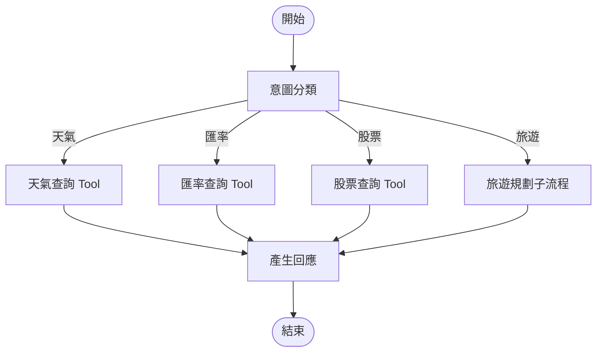
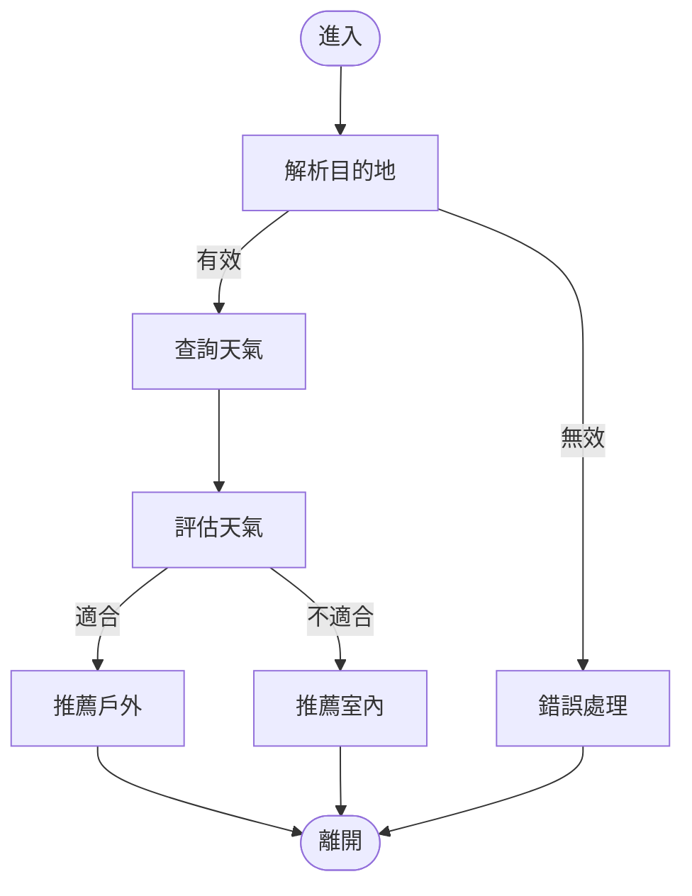

# Quickstart: LangGraph Travel Flow

**Date**: 2026-01-04
**Purpose**: 快速上手 LangGraph 流程編排功能

## 先決條件

- 已完成 000-005 功能實作
- Python 3.13 環境
- 已設定 `OPENAI_API_KEY` 環境變數

## 快速安裝

```bash
# 安裝 LangGraph 依賴
uv add langgraph
```

## 基本概念

### LangGraph 三大元件

1. **State（狀態）**: 在節點間傳遞的共享資料結構
2. **Node（節點）**: 執行特定邏輯的函式
3. **Edge（邊）**: 定義節點間的轉換關係

```python
from langgraph.graph import StateGraph, START, END
from typing import TypedDict

# 1. 定義狀態
class MyState(TypedDict):
    input: str
    output: str

# 2. 定義節點
def process_node(state: MyState) -> MyState:
    return {"output": f"處理: {state['input']}"}

# 3. 建立流程圖
builder = StateGraph(MyState)
builder.add_node("process", process_node)
builder.add_edge(START, "process")
builder.add_edge("process", END)

# 4. 編譯並執行
graph = builder.compile()
result = graph.invoke({"input": "測試"})
print(result["output"])  # 處理: 測試
```

## 條件路由範例

```python
from typing import Literal

def router(state: MyState) -> Literal["path_a", "path_b"]:
    """根據狀態決定走哪條路"""
    if "A" in state["input"]:
        return "path_a"
    return "path_b"

builder.add_conditional_edges(
    "classifier",
    router,
    {"path_a": "node_a", "path_b": "node_b"}
)
```

## 本專案使用方式

### 啟動服務

```bash
# 啟動語音助理（已整合 LangGraph 流程）
uv run python -m voice_assistant.main
```

### 測試對話

```
# 旅遊規劃流程（新增）
👤：我想去台北玩
🤖：台北目前天氣晴朗，氣溫 25 度，非常適合出遊！
    推薦行程：象山步道、陽明山國家公園、淡水老街。

# 原有功能（維持不變）
👤：高雄天氣如何？
🤖：高雄目前多雲，氣溫 28 度。

👤：100 美金換台幣多少？
🤖：100 美金大約可以換 3,150 台幣。

👤：台積電股價？
🤖：台積電目前股價是 580 元。
```

### 取得流程視覺化

```python
from voice_assistant.flows import FlowExecutor

# 取得 Mermaid 圖
executor = FlowExecutor(llm_client, tool_registry)
mermaid_code = executor.get_visualization()
print(mermaid_code)
```

將輸出的 Mermaid 程式碼貼到 [Mermaid Live Editor](https://mermaid.live) 即可看到流程圖。

## 流程架構圖

### 主路由流程



### 旅遊規劃子流程



## 擴展指南

### 新增意圖類型

1. 在 `IntentType` 新增類型
2. 在 `route_by_intent` 新增路由條件
3. 建立對應的 Tool 或 SubGraph

### 新增旅遊城市

1. 在 `TAIWAN_CITIES` 新增城市座標
2. 在 `CITY_RECOMMENDATIONS` 新增景點推薦

### 建立新的子流程

```python
# 參考 travel_planner.py 的模式
subgraph_builder = StateGraph(MySubState)
subgraph_builder.add_node(...)
subgraph = subgraph_builder.compile()

# 加入主流程
main_builder.add_node("my_subgraph", subgraph)
```

## 常見問題

### Q: 為什麼旅遊規劃比天氣查詢慢？

A: 旅遊規劃是多步驟流程（解析 → 查詢 → 評估 → 建議），需要多次 LLM/Tool 呼叫。目標延遲為 8 秒內。

### Q: 如何除錯流程問題？

A: 使用視覺化功能確認流程結構，並檢查各節點的輸入輸出狀態。

### Q: 可以關閉 LangGraph 改用原有模式嗎？

A: 可以。在初始化時不傳入 `FlowExecutor`，Pipeline 會自動降級為原有的 Tool 呼叫模式。

## 相關文件

- [spec.md](./spec.md) - 功能規格
- [plan.md](./plan.md) - 實作計畫
- [data-model.md](./data-model.md) - 資料模型
- [contracts/flow-interface.md](./contracts/flow-interface.md) - 介面合約
