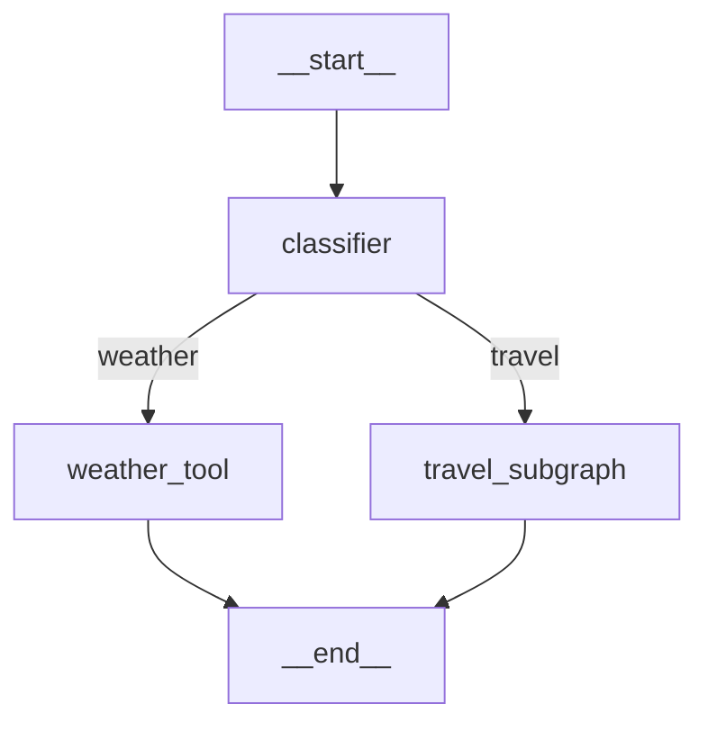

# Research: LangGraph Travel Flow

**Date**: 2026-01-04
**Purpose**: 解決 Technical Context 中的未知項目，確立技術選型

## 研究項目

### 1. LangGraph StateGraph 基礎架構

**Decision**: 使用 LangGraph `StateGraph` 作為流程編排核心

**Rationale**:
- LangGraph 是 LangChain 官方的狀態機流程框架，專為複雜 LLM 工作流設計
- 提供明確的節點（Nodes）、邊（Edges）、狀態（State）三層抽象
- 內建 Mermaid 視覺化支援 (`draw_mermaid()`, `draw_mermaid_png()`)
- 與 OpenAI SDK 良好相容，支援 Function Calling 整合

**Key Concepts**:
```python
from langgraph.graph import StateGraph, START, END
from typing import TypedDict

class State(TypedDict):
    user_input: str
    intent: str
    response: str

builder = StateGraph(State)
builder.add_node("node_name", node_function)
builder.add_edge(START, "node_name")
builder.add_edge("node_name", END)
graph = builder.compile()
```

**Alternatives Considered**:
- 原生 Function Calling + 自訂狀態機：較輕量但缺乏視覺化，未來擴展性有限
- Pydantic AI Agents：較新，社群資源較少

**Sources**:
- [LangGraph Graph API - LangChain Docs](https://docs.langchain.com/oss/python/langgraph/graph-api)
- [LangGraph: Build Stateful AI Agents - Real Python](https://realpython.com/langgraph-python/)

---

### 2. 條件路由 (Conditional Edges)

**Decision**: 使用 `add_conditional_edges()` 實作意圖分類後的路由分流

**Rationale**:
- 條件邊允許根據狀態動態決定下一個節點
- 透過路由函式回傳目標節點名稱，支援多路分流
- 適合本專案的四種意圖分類路由需求

**Implementation Pattern**:
```python
def route_by_intent(state: State) -> str:
    """根據意圖分類結果路由至對應節點"""
    intent = state["intent"]
    if intent == "weather":
        return "weather_tool"
    elif intent == "exchange":
        return "exchange_tool"
    elif intent == "stock":
        return "stock_tool"
    elif intent == "travel":
        return "travel_subgraph"
    return END

builder.add_conditional_edges(
    "classifier",
    route_by_intent,
    {
        "weather_tool": "weather_tool",
        "exchange_tool": "exchange_tool",
        "stock_tool": "stock_tool",
        "travel_subgraph": "travel_subgraph",
    }
)
```

**Alternatives Considered**:
- 單一節點內部 if-else 處理：缺乏流程視覺化，不符合 LangGraph 設計理念

**Sources**:
- [LangGraph Conditional Edges - Medium](https://medium.com/ai-agents/langgraph-for-beginners-part-3-conditional-edges-16a3aaad9f31)
- [Advanced LangGraph: Conditional Edges - DEV](https://dev.to/jamesli/advanced-langgraph-implementing-conditional-edges-and-tool-calling-agents-3pdn)

---

### 3. SubGraph 子流程組合

**Decision**: 將旅遊規劃流程實作為獨立 SubGraph，以編譯後的圖作為節點加入主流程

**Rationale**:
- SubGraph 支援獨立開發與測試
- 可複用，未來可加入其他多步驟流程
- 使用共享狀態鍵（Shared State Keys）模式，簡化狀態傳遞

**Implementation Pattern**:
```python
# 建立旅遊規劃子流程
travel_builder = StateGraph(TravelPlanState)
travel_builder.add_node("parse_destination", parse_destination)
travel_builder.add_node("query_weather", query_weather)
travel_builder.add_node("evaluate_weather", evaluate_weather)
travel_builder.add_conditional_edges(
    "evaluate_weather",
    route_by_weather_condition,
    {"suitable": "recommend_outdoor", "unsuitable": "recommend_indoor"}
)
travel_builder.add_node("recommend_outdoor", recommend_outdoor)
travel_builder.add_node("recommend_indoor", recommend_indoor)
travel_builder.add_edge("recommend_outdoor", "generate_response")
travel_builder.add_edge("recommend_indoor", "generate_response")
travel_builder.add_node("generate_response", generate_response)
travel_builder.add_edge("generate_response", END)

travel_subgraph = travel_builder.compile()

# 加入主流程
main_builder.add_node("travel_subgraph", travel_subgraph)
```

**State Sharing Strategy**:
- 使用相同的 State TypedDict 基底類別
- 子流程可擴展額外的私有狀態欄位
- 共享 `user_input`, `response` 等公共欄位

**Alternatives Considered**:
- 在主流程中直接定義所有節點：會讓主流程過於複雜，不利於維護
- 透過節點函式呼叫子流程：適合不同 schema，但本專案可共享 schema

**Sources**:
- [LangGraph Subgraphs - LangChain Docs](https://docs.langchain.com/oss/python/langgraph/use-subgraphs)
- [LangGraph Introduced SubGraphs - Medium](https://cobusgreyling.medium.com/langgraph-introduced-subgraphs-127424fcd182)

---

### 4. 與現有 Tool 整合

**Decision**: 在 LangGraph 節點內部呼叫現有的 `ToolRegistry.execute()`

**Rationale**:
- 完全保留現有 Tool-First Architecture
- Tool 節點作為 adapter，將 LangGraph 狀態轉換為 Tool 參數
- 維持 Tool 的獨立性與可測試性

**Implementation Pattern**:
```python
async def weather_tool_node(state: FlowState) -> FlowState:
    """天氣查詢節點 - 呼叫現有 WeatherTool"""
    # 從 LLM 回應中提取參數
    tool_args = extract_tool_args(state["llm_response"])

    # 呼叫現有 Tool
    result = await tool_registry.execute("get_weather", tool_args)

    # 更新狀態
    return {**state, "tool_result": result}
```

**Alternatives Considered**:
- 在 LangGraph 內部重新實作 Tool 邏輯：違反 DRY 原則，增加維護成本

---

### 5. Mermaid 視覺化輸出

**Decision**: 使用 LangGraph 內建的 `get_graph().draw_mermaid()` 方法

**Rationale**:
- 零額外依賴
- 自動根據流程圖結構產生 Mermaid 程式碼
- 支援 Mermaid.live 線上預覽

**Implementation Pattern**:
```python
# 產生 Mermaid 程式碼
mermaid_code = graph.get_graph().draw_mermaid()
print(mermaid_code)

# 產生 PNG 圖片（需要額外依賴）
from IPython.display import Image
Image(graph.get_graph().draw_mermaid_png())
```

**Output Example**:


**Sources**:
- [LangGraph Visualization - Kite Metric](https://kitemetric.com/blogs/visualizing-langgraph-workflows-with-get-graph)

---

### 6. LangGraph 版本與相容性

**Decision**: 使用 `langgraph>=1.0.5`（最新穩定版）

**Rationale**:
- LangGraph 1.x 為正式穩定版，API 穩定
- 確保支援 SubGraph、Conditional Edges 等必要功能
- 與現有 `openai>=1.58.x` 相容
- Python 3.13 支援

**Dependencies to Add**:
```toml
[project.dependencies]
langgraph = ">=1.0.5"
```

**Compatibility Notes**:
- LangGraph 不強制要求使用 LangChain LLM wrapper
- 可直接使用 OpenAI SDK，LangGraph 僅負責流程編排
- 不需要 `langchain-openai` 套件

---

## 技術決策總結

| 項目 | 決策 | 理由 |
|------|------|------|
| 流程框架 | LangGraph StateGraph | 狀態管理強大、視覺化支援、社群活躍 |
| 意圖路由 | Conditional Edges | 動態路由、視覺化清晰 |
| 子流程 | Compiled SubGraph | 模組化、可複用、獨立測試 |
| Tool 整合 | 節點內呼叫 ToolRegistry | 保留現有架構、DRY 原則 |
| 視覺化 | 內建 draw_mermaid() | 零額外依賴、自動產生 |
| 依賴版本 | langgraph>=1.0.5 | 最新穩定、功能完整 |

---

## 風險評估

| 風險 | 影響 | 緩解措施 |
|------|------|----------|
| LangGraph 學習曲線 | 中 | 提供 quickstart.md 快速上手指南 |
| 與 OpenAI SDK 整合複雜度 | 低 | LangGraph 不強制使用 LangChain wrapper |
| SubGraph 狀態傳遞錯誤 | 中 | 使用共享 State 模式，撰寫完整測試 |
| Mermaid 視覺化版本差異 | 低 | 使用官方 API，避免直接操作內部結構 |
