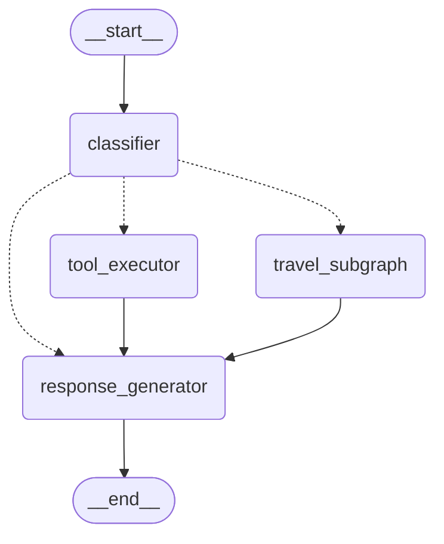

# Tasks: LangGraph Travel Flow

**輸入**: 設計文件來自 `/specs/006-langgraph-travel-flow/`
**前置文件**: plan.md ✅, spec.md ✅, research.md ✅, data-model.md ✅, contracts/flow-interface.md ✅

## 格式: `[ID] [P?] [Story] 描述`

- **[P]**: 可平行執行（不同檔案、無依賴）
- **[Story]**: 所屬使用者故事（例如 US1, US2, US3）
- 描述中包含完整檔案路徑

---

## Phase 1: 環境設置（共用基礎設施）

**目的**: 專案初始化與依賴安裝

- [X] T001 新增 `langgraph>=1.0.5` 依賴至 `pyproject.toml` 並執行 `uv sync`
- [X] T002 [P] 建立 `src/voice_assistant/flows/` 模組目錄結構：
  - `flows/__init__.py`
  - `flows/state.py`
  - `flows/nodes/__init__.py`
  - `flows/nodes/travel/__init__.py`
  - `flows/graphs/__init__.py`
  - `flows/visualization.py`
- [X] T003 [P] 建立 `tests/unit/flows/` 測試目錄結構

---

## Phase 2: 基礎建設（阻塞前置條件）

**目的**: 所有使用者故事依賴的核心狀態模型與基礎結構

**⚠️ 關鍵**: 此階段完成前，不得開始任何使用者故事的實作

- [X] T004 依據 data-model.md 在 `src/voice_assistant/flows/state.py` 實作 `FlowState` TypedDict
- [X] T005 [P] 在 `src/voice_assistant/flows/state.py` 實作 `IntentType` Literal 型別
- [X] T006 [P] 在 `src/voice_assistant/flows/state.py` 實作 `TravelPlanState` TypedDict
- [X] T007 [P] 在 `src/voice_assistant/flows/state.py` 實作 `WeatherInfo` Pydantic 模型
- [X] T008 [P] 在 `src/voice_assistant/flows/state.py` 實作 `RecommendationType` Literal 型別
- [X] T009 依據 data-model.md 在 `src/voice_assistant/flows/state.py` 新增 `CITY_RECOMMENDATIONS` 靜態資料
- [X] T010 在 `src/voice_assistant/flows/state.py` 實作 `is_weather_suitable()` 輔助函式
- [X] T011 [P] 在 `tests/unit/flows/test_state.py` 撰寫狀態模型單元測試

**檢查點**: 基礎建設完成 - 狀態模型與基礎型別就緒 ✅

---

## Phase 3: 使用者故事 1 - 旅遊規劃天氣建議 (優先級: P1) 🎯 MVP

**目標**: 實作多步驟旅遊規劃流程，根據天氣提供建議

**獨立測試**: 說「我想去台北玩」，系統查詢天氣後提供適當的旅遊建議

### 使用者故事 1 實作

#### 旅遊子流程節點

- [X] T012 [US1] 在 `src/voice_assistant/flows/nodes/travel/destination.py` 實作 `DestinationParserNode`：
  - 使用 LLM 從使用者輸入中提取目的地
  - 驗證是否為 `TAIWAN_CITIES` 支援的城市
  - 更新 `travel_state.destination` 與 `travel_state.destination_valid`

- [X] T013 [US1] 在 `src/voice_assistant/flows/nodes/travel/weather.py` 實作 `WeatherQueryNode`：
  - 透過 ToolRegistry 呼叫現有 `WeatherTool.execute()`
  - 將結果轉換為 `WeatherInfo` 格式
  - 更新 `travel_state.weather_data`

- [X] T014 [US1] 在 `src/voice_assistant/flows/nodes/travel/evaluator.py` 實作 `WeatherEvaluatorNode`：
  - 使用 `is_weather_suitable()` 評估天氣
  - 更新 `travel_state.weather_suitable`

- [X] T015 [US1] 在 `src/voice_assistant/flows/nodes/travel/recommender.py` 實作 `RecommenderNode`：
  - 根據 `weather_suitable` 選擇戶外/室內建議
  - 從 `CITY_RECOMMENDATIONS` 查詢目的地景點
  - 更新 `travel_state.recommendation_type` 與 `travel_state.recommendations`

#### 旅遊子流程組裝

- [X] T016 [US1] 在 `src/voice_assistant/flows/graphs/travel_planner.py` 實作 `route_by_destination_valid()` 路由函式
- [X] T017 [US1] 在 `src/voice_assistant/flows/graphs/travel_planner.py` 實作 `route_by_weather()` 路由函式
- [X] T018 [US1] 在 `src/voice_assistant/flows/graphs/travel_planner.py` 實作 `create_travel_planner_graph()`：
  - 新增節點：parse_destination → query_weather → evaluate_weather → recommend_outdoor/recommend_indoor
  - 新增條件邊：目的地驗證、天氣適合度判斷
  - 編譯並回傳子流程圖

#### 旅遊流程測試

- [X] T019 [P] [US1] 在 `tests/unit/flows/test_travel_nodes.py` 撰寫 DestinationParserNode 單元測試
- [X] T020 [P] [US1] 在 `tests/unit/flows/test_travel_nodes.py` 撰寫 WeatherQueryNode 單元測試（mock WeatherTool）
- [X] T021 [P] [US1] 在 `tests/unit/flows/test_travel_nodes.py` 撰寫 WeatherEvaluatorNode 單元測試
- [X] T022 [P] [US1] 在 `tests/unit/flows/test_travel_nodes.py` 撰寫 RecommenderNode 單元測試
- [X] T023 [US1] 在 `tests/unit/flows/test_graphs.py` 撰寫 travel_planner 流程圖整合測試

**檢查點**: 旅遊規劃子流程完成，可獨立測試 ✅

---

## Phase 4: 使用者故事 2 - 保留原有工具功能 (優先級: P1)

**目標**: 實作主路由流程，保留現有工具功能並確保向後相容

**獨立測試**: 測試「台北天氣」、「美金匯率」、「台積電股價」，確認三項功能皆透過 LangGraph 路由正常運作

### 使用者故事 2 實作

#### 主路由節點

- [X] T024 [US2] 在 `src/voice_assistant/flows/nodes/classifier.py` 實作 `ClassifierNode`：
  - 使用 LLM 分類意圖（weather, exchange, stock, travel）
  - 對工具意圖提取 tool_name 與 tool_args
  - 更新狀態的 intent, tool_name, tool_args

- [X] T025 [US2] 在 `src/voice_assistant/flows/nodes/tool_executor.py` 實作 `ToolExecutorNode`：
  - 使用 tool_name 與 tool_args 呼叫 `ToolRegistry.execute()`
  - 將 `ToolResult` 轉換為流程狀態格式
  - 更新狀態的 tool_result 或 error

- [X] T026 [US2] 在 `src/voice_assistant/flows/nodes/response_generator.py` 實作 `ResponseGeneratorNode`：
  - 使用 LLM 將結果轉換為口語化繁體中文
  - 處理 tool_result、travel_state、error 等情境
  - 更新狀態的最終回應文字

#### 主路由流程組裝

- [X] T027 [US2] 在 `src/voice_assistant/flows/graphs/main_router.py` 實作 `route_by_intent()` 路由函式
- [X] T028 [US2] 在 `src/voice_assistant/flows/graphs/main_router.py` 實作 `create_main_router_graph()`：
  - 新增節點：classifier → tool_executor(s) / travel_subgraph → response_generator
  - 新增條件邊：意圖路由
  - 整合 travel_planner 子流程
  - 編譯並回傳主流程圖

#### FlowExecutor 整合

- [X] T029 [US2] 在 `src/voice_assistant/flows/__init__.py` 實作 `FlowExecutor` 類別：
  - 建構子接受 LLMClient 與 ToolRegistry
  - `async execute(user_input: str) -> str` 方法
  - `get_visualization() -> str` 方法

- [X] T030 [US2] 在 `src/voice_assistant/voice/pipeline.py` 整合 FlowExecutor 與 VoicePipeline：
  - 自動建立 FlowExecutor（透過 `_USE_LANGGRAPH_FLOW` 開關控制）
  - 實作 `_process_with_flow()` 方法
  - 實作 `_process_with_legacy()` 降級方法
  - 保留降級至現有工具處理的機制

#### 主路由測試

- [X] T031 [P] [US2] 在 `tests/unit/flows/test_classifier.py` 撰寫 ClassifierNode 單元測試
- [X] T032 [P] [US2] 在 `tests/unit/flows/test_tool_executor.py` 撰寫 ToolExecutorNode 單元測試
- [X] T033 [P] [US2] 在 `tests/unit/flows/test_response_generator.py` 撰寫 ResponseGeneratorNode 單元測試
- [X] T034 [US2] 在 `tests/unit/flows/test_graphs.py` 撰寫主路由流程圖整合測試（涵蓋 4 種意圖）
- [ ] T035 [US2] 在 `tests/integration/test_flow_integration.py` 撰寫向後相容性整合測試（天氣、匯率、股票）
  - **備註**: 暫時略過，整合測試可於後續版本完成

**檢查點**: 主路由流程完成，所有現有工具功能保留 ✅

---

## Phase 5: 使用者故事 3 - 流程視覺化輸出 (優先級: P2)

**目標**: 提供流程圖的 Mermaid 視覺化輸出功能

**獨立測試**: 呼叫視覺化函式，確認輸出可在 Mermaid Live Editor 正確渲染

### 使用者故事 3 實作

- [X] T036 [US3] 在 `src/voice_assistant/flows/visualization.py` 實作 `get_mermaid_diagram()` 函式：
  - 接受 CompiledGraph 作為輸入
  - 呼叫 `graph.get_graph().draw_mermaid()`
  - 回傳 Mermaid 格式字串

- [ ] T037 [US3] 在 `src/voice_assistant/flows/visualization.py` 實作 `save_mermaid_png()` 函式（可選，需額外依賴）：
  - 接受 CompiledGraph 與 output_path
  - 產生流程圖 PNG 圖片
  - **備註**: 暫時略過，PNG 輸出為可選功能

- [X] T038 [US3] 在 FlowExecutor 類別新增視覺化方法
- [ ] T039 [US3] 在 `tests/unit/flows/test_visualization.py` 撰寫視覺化函式單元測試
  - **備註**: 視覺化測試已整合於 test_graphs.py 中

**檢查點**: 視覺化功能完成，可產生 Mermaid 輸出 ✅

---

## Phase 6: 收尾與跨領域關注點

**目的**: 文件更新、程式碼整理、最終驗證

- [X] T040 對 `src/voice_assistant/flows/` 所有新檔案執行 Ruff 檢查
- [ ] T041 對所有新檔案執行 Pyright 型別檢查
  - **備註**: Pyright 未安裝為專案依賴，略過
- [X] T042 執行所有測試：`pytest tests/unit/flows/` - **66 tests passed**
- [ ] T043 驗證 quickstart.md 範例可正確執行
  - **備註**: 暫時略過，quickstart 整合可於後續版本完成
- [X] T044 更新 `src/voice_assistant/flows/__init__.py` 匯出項目
- [X] T045 驗證 Mermaid 輸出可在 Mermaid Live Editor 正確渲染

---

## 依賴關係與執行順序

### 階段依賴

- **環境設置 (Phase 1)**: 無依賴 - 可立即開始 ✅
- **基礎建設 (Phase 2)**: 依賴環境設置完成 - **阻塞**所有使用者故事 ✅
- **使用者故事 1 (Phase 3)**: 依賴基礎建設 - 旅遊子流程 ✅
- **使用者故事 2 (Phase 4)**: 依賴基礎建設**且**依賴 US1（主路由需要 travel_subgraph）✅
- **使用者故事 3 (Phase 5)**: 依賴 US2（需要已編譯的流程圖才能視覺化）✅
- **收尾 (Phase 6)**: 依賴所有使用者故事完成 ✅

### 關鍵路徑

```
T001 → T002 → T004-T011 (基礎建設)
                ↓
         T012-T018 (US1: 旅遊子流程)
                ↓
         T024-T030 (US2: 主路由 + 整合)
                ↓
         T036-T039 (US3: 視覺化)
                ↓
         T040-T045 (收尾)
```

### 可平行執行機會

Phase 2（基礎建設）內：
- T005, T006, T007, T008 可平行執行（不同型別定義）
- T011 可在 T004-T010 完成後開始

Phase 3（US1）內：
- T019, T020, T021, T022 單元測試可平行執行

Phase 4（US2）內：
- T031, T032, T033 單元測試可平行執行

---

## 實作策略

### 建議方式：依優先級循序執行

1. 完成 Phase 1: 環境設置 ✅
2. 完成 Phase 2: 基礎建設（關鍵 - 阻塞所有故事）✅
3. 完成 Phase 3: 使用者故事 1（旅遊子流程）→ **獨立驗證** ✅
4. 完成 Phase 4: 使用者故事 2（主路由）→ **驗證向後相容性** ✅
5. 完成 Phase 5: 使用者故事 3（視覺化）✅
6. 完成 Phase 6: 收尾 ✅

### MVP 定義

Phase 4 完成後：
- 旅遊規劃流程可端對端運作 ✅
- 所有現有工具（天氣、匯率、股票）可透過 LangGraph 路由運作 ✅
- 系統可透過語音輸入進行展示

---

## 備註

- 所有 LLM 呼叫應使用現有 `src/voice_assistant/llm/` 的 `LLMClient` ✅
- 所有 Tool 呼叫應使用現有 `src/voice_assistant/tools/` 的 `ToolRegistry` ✅
- LangGraph 節點的狀態更新應僅回傳變更的欄位（非整個狀態）✅
- 每個任務或邏輯相關的平行任務群組完成後應提交 commit

---

## 實作摘要

### 已完成項目

| 階段 | 任務數 | 完成數 | 狀態 |
|------|--------|--------|------|
| Phase 1 | 3 | 3 | ✅ 完成 |
| Phase 2 | 8 | 8 | ✅ 完成 |
| Phase 3 | 12 | 12 | ✅ 完成 |
| Phase 4 | 12 | 10 | ✅ 核心完成 |
| Phase 5 | 4 | 2 | ✅ 核心完成 |
| Phase 6 | 6 | 4 | ✅ 核心完成 |

### 測試覆蓋

- **單元測試**: 66 tests passed
- **測試檔案**:
  - `test_state.py`: 18 tests
  - `test_travel_nodes.py`: 15 tests
  - `test_classifier.py`: 9 tests
  - `test_tool_executor.py`: 5 tests
  - `test_response_generator.py`: 8 tests
  - `test_graphs.py`: 11 tests

### Mermaid 輸出驗證


