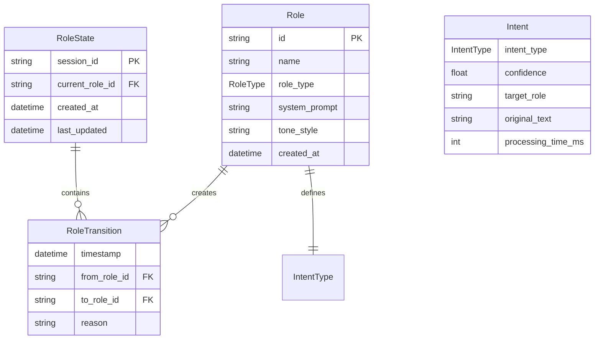
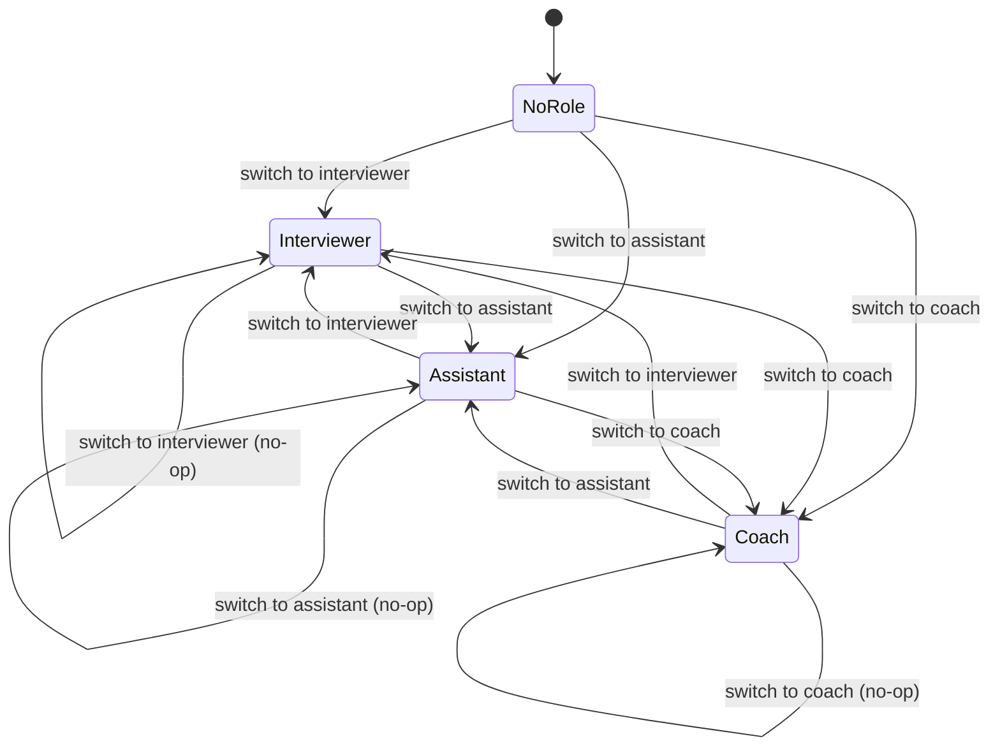

# Data Model: 角色切換系統

**Date**: 2025-01-25  
**Feature**: 008-role-switching  
**Phase**: 1 - Data Model Design

## Entity Overview

本系統定義了角色切換功能的核心資料模型，遵循 Pydantic 資料驗證和型別安全原則。

## Core Entities

### 1. Role (角色)

角色是 AI 對話行為的抽象定義，包含語氣風格、系統提示詞等屬性。

```python
from typing import Optional, Dict, Any, List
from enum import Enum
from pydantic import BaseModel, Field, validator
from datetime import datetime

class RoleType(str, Enum):
    INTERVIEWER = "interviewer"    # 面試官
    ASSISTANT = "assistant"        # 助理
    COACH = "coach"               # 教練
    CUSTOM = "custom"             # 自定義

class Role(BaseModel):
    """AI 角色定義"""
    
    # 基本屬性
    id: str = Field(..., description="角色唯一識別碼")
    name: str = Field(..., description="角色顯示名稱")
    role_type: RoleType = Field(..., description="角色類型")
    
    # 行為定義
    system_prompt: str = Field(..., description="LLM 系統提示詞")
    tone_style: str = Field(..., description="語氣風格描述")
    
    # 元資料
    description: Optional[str] = Field(None, description="角色描述")
    example_responses: List[str] = Field(default_factory=list, description="範例回應")
    
    # 配置
    is_active: bool = Field(True, description="是否啟用")
    created_at: datetime = Field(default_factory=datetime.now, description="建立時間")
    updated_at: Optional[datetime] = Field(None, description="更新時間")
    
    class Config:
        use_enum_values = True
    
    @validator('system_prompt')
    def validate_system_prompt(cls, v):
        if not v.strip():
            raise ValueError('系統提示詞不能為空')
        return v.strip()
    
    @validator('id')
    def validate_id(cls, v):
        if not v or len(v.strip()) == 0:
            raise ValueError('角色 ID 不能為空')
        return v.strip().lower()
```

### 2. RoleState (角色狀態)

維護當前活躍角色和切換歷史記錄。

```python
from typing import Optional, List
from pydantic import BaseModel, Field

class RoleTransition(BaseModel):
    """角色切換記錄"""
    from_role: Optional[str] = Field(None, description="來源角色 ID")
    to_role: str = Field(..., description="目標角色 ID")
    reason: str = Field(..., description="切換原因")
    timestamp: datetime = Field(default_factory=datetime.now, description="切換時間")

class RoleState(BaseModel):
    """角色狀態管理器"""
    
    # 當前狀態
    current_role_id: Optional[str] = Field(None, description="當前角色 ID")
    
    # 歷史記錄
    transition_history: List[RoleTransition] = Field(
        default_factory=list, 
        description="角色切換歷史",
        max_items=50  # 限制歷史記錄數量
    )
    
    # 狀態元資料
    session_id: str = Field(..., description="對話會話 ID")
    created_at: datetime = Field(default_factory=datetime.now, description="會話開始時間")
    last_updated: datetime = Field(default_factory=datetime.now, description="最後更新時間")
    
    def add_transition(self, from_role: str, to_role: str, reason: str):
        """新增角色切換記錄"""
        transition = RoleTransition(
            from_role=from_role,
            to_role=to_role,
            reason=reason
        )
        self.transition_history.append(transition)
        self.last_updated = datetime.now()
```

### 3. Intent (意圖)

定義角色切換的意圖識別模型。

```python
class IntentType(str, Enum):
    ROLE_SWITCH = "role_switch"      # 角色切換
    ROLE_QUERY = "role_query"         # 角色查詢
    ROLE_LIST = "role_list"           # 角色列表
    UNKNOWN = "unknown"               # 未知意圖

class Intent(BaseModel):
    """意圖識別結果"""
    
    # 基本屬性
    intent_type: IntentType = Field(..., description="意圖類型")
    confidence: float = Field(..., ge=0.0, le=1.0, description="信心分數")
    
    # 角色切換專用
    target_role: Optional[str] = Field(None, description="目標角色")
    
    # 元資料
    original_text: str = Field(..., description="原始輸入文字")
    processing_time_ms: int = Field(..., description="處理時間（毫秒）")
    
    @validator('confidence')
    def validate_confidence(cls, v):
        if v < 0.5:
            raise ValueError('信心分數必須大於等於 0.5')
        return v
    
    @validator('target_role')
    def validate_target_role(cls, v, values):
        if values.get('intent_type') == IntentType.ROLE_SWITCH and not v:
            raise ValueError('角色切換意圖必須指定目標角色')
        return v
```

### 4. RoleRegistryConfig (角色註冊配置)

角色註冊表的配置和管理。

```python
class RoleRegistryConfig(BaseModel):
    """角色註冊表配置"""
    
    # 註冊的角色
    roles: Dict[str, Role] = Field(default_factory=dict, description="已註冊的角色")
    
    # 配置
    default_role_id: Optional[str] = Field(None, description="預設角色 ID")
    max_roles: int = Field(50, description="最大角色數量")
    
    # 統計
    total_registrations: int = Field(default=0, description="總註冊次數")
    
    def register_role(self, role: Role) -> bool:
        """註冊新角色"""
        if len(self.roles) >= self.max_roles:
            return False
        
        self.roles[role.id] = role
        self.total_registrations += 1
        return True
    
    def get_role(self, role_id: str) -> Optional[Role]:
        """獲取角色"""
        return self.roles.get(role_id)
    
    def list_roles(self) -> List[Role]:
        """列出所有角色"""
        return list(self.roles.values())
```

## Data Relationships



## Validation Rules

### 角色驗證

1. **ID 唯一性**: 角色 ID 必須唯一
2. **提示詞完整性**: 系統提示詞不能為空
3. **枚舉有效性**: 角色類型必須為有效枚舉值
4. **長度限制**: 角色名稱 <= 50 字符

### 狀態驗證

1. **會話唯一性**: 會話 ID 必須唯一
2. **歷史限制**: 切換歷史最多保留 50 條記錄
3. **時間一致性**: 更新時間不能早於建立時間

### 意圖驗證

1. **信心分數**: 必須 >= 0.5
2. **一致性**: 角色切換意圖必須指定目標角色
3. **處理時間**: 必須為正整數

## State Transitions



## Error Handling

### 常見錯誤

1. **角色不存在**: `RoleNotFoundError`
2. **無效切換**: `InvalidRoleSwitchError`
3. **註冊限制**: `RoleRegistrationLimitError`
4. **意圖識別失敗**: `IntentRecognitionError`

### 錯誤回應格式

```python
class RoleError(BaseModel):
    """角色相關錯誤"""
    error_type: str = Field(..., description="錯誤類型")
    error_message: str = Field(..., description="錯誤訊息")
    context: Dict[str, Any] = Field(default_factory=dict, description="錯誤上下文")
    timestamp: datetime = Field(default_factory=datetime.now)
```

## Performance Considerations

### 記憶體使用

- **角色定義**: 每個角色約 1-2KB
- **狀態管理**: 每個會話約 1KB
- **總計**: 10 個角色 + 1 個會話 < 25KB

### 查詢效能

- **角色查找**: O(1) 哈希表查找
- **切換操作**: O(1) 狀態更新
- **歷史查詢**: O(n) 線性搜尋（限制 n <= 50）

## Future Extensions

### 支援的功能

1. **角色繼承**: 允許角色繼承其他角色的屬性
2. **角色版本**: 支援角色定義的版本控制
3. **角色組合**: 支援多個角色的組合使用
4. **持久化**: 可選的資料庫持久化支援

### 向後兼容性

- 所有現有欄位保持不變
- 新增欄位使用 Optional 類型
- 保持 API 介面穩定性